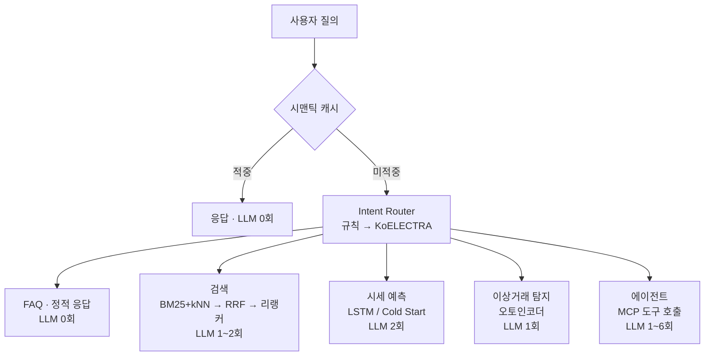
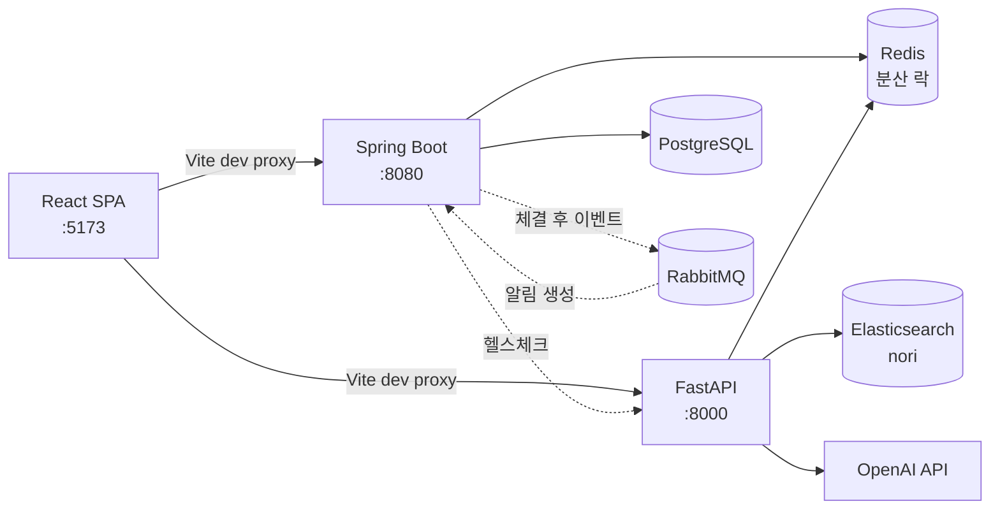

# 게임 아이템 통합 거래 플랫폼

여러 게임사(테넌트)의 아이템·계정·게임머니를 하나의 플랫폼에서 거래하는
멀티테넌트 거래소. **요청 유형별로 다른 AI 파이프라인을 태워** 지연시간과
비용을 유형 단위로 통제한다.

`Spring Boot 4` · `Java 21` · `FastAPI` · `Python 3.11` · `React` ·
`PostgreSQL` · `Elasticsearch` · `Redis` · `RabbitMQ` · `Docker`

[](https://github.com/blacktaione2/game-item-marketplace-ai/actions/workflows/ai.yml)
[](https://github.com/blacktaione2/game-item-marketplace-ai/actions/workflows/backend.yml)
[](https://github.com/blacktaione2/game-item-marketplace-ai/actions/workflows/frontend.yml)

> ## ⚠️ 공개 데모 계정입니다
>
> **비밀번호 로그인이 실제로 동작합니다**([ADR-0031](docs/01-Decisions/0031-공개-준비-인증-비용-신뢰프록시.md)) —
> BCrypt 검증, 401, 사용자 열거 차단. 회원가입은 **일부러 없습니다**: 계정은 시드로
> 고정이고, 가입을 열면 이메일 인증·비밀번호 재설정·스팸 계정 방어가 따라옵니다.
>
> **데모 계정 비밀번호를 공개하는 것은 모순이 아닙니다.** 로그인 게이트의 목적은
> 접근 제한이 아니라 **익명 대량 호출 차단**입니다 — LLM 호출에 실제로 돈이 나가기
> 때문입니다. 비밀번호가 알려져도 (a) 봇이 자동으로 넘지 못하고 (b) 사용자당
> **하루 50회** 한도가 걸립니다. 진짜 상한은 OpenAI 월 사용량 한도입니다.
>
> **GM 계정 비밀번호는 공개하지 않습니다** — 그게 비밀번호를 둘로 나눈 이유입니다.
> 이상거래 큐는 GM 전용이라, 하나였다면 역할 인가가 무의미해집니다.

---

## 설계 목표

**"LLM API를 감싸기만 한 서비스"가 되지 않는 것.**

모든 요청을 하나의 LLM 호출로 흘려보내면 간단하지만, 그러면 FAQ 한 줄에도
검색 한 번에도 같은 비용과 지연이 붙는다. 이 프로젝트는 요청이 무엇인지 먼저
판별하고 종류마다 다른 경로를 태운다.



| 요청 유형 | 파이프라인 | LLM 호출 |
|---|---|---|
| FAQ·스몰토크 | 정적 응답 | **0회** |
| 아이템 검색 | Rewrite+Text-to-DSL → BM25+kNN → RRF → 크로스인코더 재순위 | 1~2회 |
| 시세 문의 | 거래 이력 충분 시 LSTM, 부족하면 Cold Start 백오프 | 2회 |
| 이상거래 점검 | 오토인코더 재구성 오차 + 피처별 기여도 분해 | 1회 |
| 복합 질의 | MCP 도구를 부르는 순차 에이전트 | 1~6회 |

체결 자체는 AI를 거치지 않는다 — Redis 락 + DB 트랜잭션이고, **체결 후 알림만** RabbitMQ로 넘긴다([ADR-0030](docs/01-Decisions/0030-비동기-후처리-mq.md)).

상세: [요청 타입별 파이프라인](docs/02-AI-Pipeline/요청-타입별-파이프라인.md)

### 아키텍처



Vite dev proxy가 브라우저에 단일 오리진만 보여주므로 **양쪽 서버 모두 CORS
설정이 없다.**

---

## 측정된 결과

이 프로젝트에서 가장 신경 쓴 것은 기능 수가 아니라 **주장에 근거가 붙어
있는가**다. 그래서 개선한 것과 **기각한 것을 같이 적는다.**

### 개선

| 항목 | 이전 | 이후 |
|---|---|---|
| 임베딩 파인튜닝 — 홀드아웃 Recall@1 | 0.148 | **0.389** |
| 임베딩 파인튜닝 — 홀드아웃 MRR | 0.301 | **0.510** |
| 하드 필터 — 부적합 검색 결과 | 50건 | **14건** (적합 손실 0) |
| 질의 재작성 결정성 — 토큰집합 모드 일치율 | 0.840 | **0.990** |
| 0건 응답 — 같은 입력 5회의 답변 종류 | 5가지 | **1가지** |
| 캐시 적중 — 전체 p95 | 279ms | **25.9ms** (10.8배) |
| 캐시 적중 — 처리량 | 48 req/s | **316 req/s** (6.6배) |
| 이벤트 루프 지연 — p99 (검색 부하 중) | 29.33ms | **10.65ms** |
| 프론트 첫 로드 — gzip | 201.3 KB | **92.2 KB** (54% 감소) |

### 기각 — 재보고 접은 것

| 항목 | 결론 |
|---|---|
| **리랭커 점수 하한** | **2회 측정, 2회 기각.** 사유가 달랐다 — 처음엔 노이즈가 마진보다 커서, 두 번째는 질의 간 점수 눈금이 비교 불가라서. [ADR-0018](docs/01-Decisions/0018-리랭커-하한-재측정.md) |
| **시맨틱 캐시 유사도 매칭** | 함정 쌍(`+8 롱소드` vs `+9 롱소드`)이 0.9787인데 동의 쌍은 0.845. **함정이 더 유사하다.** FAQ에만 허용 |
| **프롬프트로 혼동 방지** | `불속성`/`무속성`을 구분하라는 한 줄이 정답률을 **97.5% → 22%** 로 떨어뜨렸다. 되돌림 |
| ~~**캐시 임베딩 지연화**~~ | **기각했다가 당일 뒤집혔다.** "임베딩은 27%뿐"이라 접었는데, 격리해보니 **그 27%가 나머지 73%를 만들고 있었다** — 동기 CPU 호출이 이벤트 루프를 막아 남의 대기가 조회 시간으로 잡혔다. 기록은 지우지 않고 정정만 붙였다. [ADR-0025](docs/01-Decisions/0025-관측성-2단계-착수-보류와-분해-측정.md) → [0026](docs/01-Decisions/0026-적중-경로-임베딩-지연화.md) |
| **관측성 2단계(ELK·트레이싱)** | ADR-0019가 "부하테스트가 지목할 때" 착수로 걸어둔 조건이 **세 라운드 동안 걸리지 않았다.** 백엔드→AI 호출은 여전히 헬스체크 하나다 |
| **`asyncio.to_thread`** | 로드맵에 그 이름으로 등록해뒀는데 **측정이 기각했다.** 기본 실행기(대상 8스레드)에서 torch가 **+85% 느려진다** — 이미 내부적으로 intra-op 스레드를 쓰기 때문이다. 크기 2의 전용 풀로 대체. [ADR-0028](docs/01-Decisions/0028-동기-cpu-호출-스레드-분리.md) |
| **판정선 `티커 max < 20ms`** | 사전 등록했는데 **같은 코드가 32.75ms와 17.89ms를 냈다.** 부하 0인 서버가 이미 16.34ms(타이머 분해능)라 판정선이 잡음 안에 있었다. **고쳐서 통과시키지 않고 실패로 남겼다** — 채택 근거는 두 실행이 일치한 p99와 초과 건수다 |
| **기획서 그대로의 MQ 흐름** | 거래 처리를 큐로 보내면 `201→202` 계약 변경 + **오버셀 단언이 응답 시점에 성립하지 않는다.** 26,600건에서 검증한 보장을 지키는 쪽을 택하고, 큐는 **체결 후 알림**을 맡는다. [ADR-0030](docs/01-Decisions/0030-비동기-후처리-mq.md) |
| **컨테이너 CORS 검사(초안)** | 일부러 CORS를 켜고 돌렸더니 **통과했다.** `/api/ai/health`가 404였는데(AI 헬스는 `/health`) 404엔 미들웨어가 안 붙는다. **검사가 대상에 닿았는지를 확인하지 않으면 아무것도 확인하지 않는다** — 404면 실패로 보고하도록 고쳤다. [ADR-0029](docs/01-Decisions/0029-컨테이너화.md) |

### 부하테스트 실측 ([ADR-0020](docs/01-Decisions/0020-부하테스트.md))

k6. **지연시간 목표를 미리 걸지 않고**, 자의적이지 않은 이진 기준만 검증했다.

| | 결과 |
|---|---|
| **오버셀** | **0건** — 동시 구매 26,600여 건에서 `재고 감소분 == 성공 응답 수`. 분산 락 + 낙관적 락의 주장을 실동시성에서 처음 검증 |
| 처리량 상한 (단일 아이템 경합) | **107 req/s**, knee ≈ 4 VU |
| 병목 — 경합 시 | 락 **대기** 0.178s vs **보유** 0.007s → 큐잉 |
| 병목 — 분산 시 | 429 req/s로 4배, 대신 보유가 5배 올라 **DB가 제약** |
| AI 검색 (캐시 적중) | 당시 p95 **283ms** — 이후 **25.9ms**로 개선([ADR-0026](docs/01-Decisions/0026-적중-경로-임베딩-지연화.md)) |
| AI 검색 (실 LLM) | p95 **4.45s** — 그중 **97%가 LLM 2회**. ES+리랭커+임베딩은 82ms |

**병목은 하나가 아니라 부하 형태에 따라 옮겨간다.** 대조군(분산 프로파일)
없이 쟀으면 "락이 병목"에서 끝났을 것이다.

부하 생성기가 측정 대상과 같은 박스(4 OCPU 공유)에 있어 **보수적인 수치**다.

### 보안 — 붙인 뒤에 재봤다 ([ADR-0023](docs/01-Decisions/0023-jwt-인증.md) · [0024](docs/01-Decisions/0024-요청-한도.md))

| 확인 | 결과 |
|---|---|
| 인증 비용 | **요청당 0.7ms** — 312ms 요청의 **0.22%**. `spring_security_filterchains_seconds` 실측 |
| 헤더 위조 | 정상 토큰에 `X-Tenant-Id: 2`를 덧붙여도 **무시된다** (헤더 경로가 실제로 죽음) |
| 역할 인가 | GM 큐가 USER 토큰에 **403** — 메뉴를 숨기는 것과 달리 URL 직접 접근도 막힌다 |
| 한도 | 20회 통과 → **21회차 429**, 그리고 **한 사용자가 막혀도 다른 사용자는 통과** |
| 인증 후 오버셀 | **0건 유지** (834 == 834) |

**처리량이 떨어져 보였지만 인증 탓이 아니었다** — 가설 두 개(인증 오버헤드,
테이블 누적)를 세워 **둘 다 측정으로 기각**했고, 귀속시킬 근거가 없어
귀속시키지 않았다.

### 기준선 대비 — 이긴 것과 진 것

모든 모델을 단순 기준선과 비교했고 **진 것은 진 대로 적는다.**

| 모델 | 결과 |
|---|---|
| 시세 예측 LSTM | MAPE 4.70% vs 최고 naive 4.87%. **이겼지만 근소하다** — 합성 데이터라 예측 가능한 정보량이 원래 적다 |
| 이상탐지 오토인코더 | 신규 계정 거래는 **규칙(`max\|z\|`)이 100%, AE는 놓친다.** 여러 축에 흩어진 이상은 반대. 상호 보완이지 대체가 아니다 |
| 의도 라우터 | 확신도가 **교정되어 있지 않다**(틀린 답 0.978 vs 맞은 답 0.991). 임계값이 아니라 학습 데이터로 고쳤다 |

---

## 실행 방법

### 사전 요구사항

Docker · JDK 21 · Python 3.11 · Node.js · **OpenAI API 키**(런타임에만 필요)

### 1. 인프라

```bash
cp .env.example .env      # 필요하면 포트·자격증명 조정
docker compose up -d      # PostgreSQL · Elasticsearch · Redis · RabbitMQ
```

> **전부 컨테이너로 띄우려면** `docker compose --profile app up -d` ([ADR-0029](docs/01-Decisions/0029-컨테이너화.md)).
> nginx가 `http://localhost` 하나로 SPA와 두 API를 서빙한다 — 개발의 Vite dev
> proxy와 같은 역할이라 **양쪽 서버 모두 CORS 설정이 없는 상태 그대로**다.
>
> 첫 기동에서 `ai-init` 컨테이너가 모델 5종을 만들고 ES를 색인한다(수 분, LLM
> 호출 없음). **기본 `docker compose up -d`의 의미는 바뀌지 않았다** — 여전히
> 인프라만 띄운다. 아래 로컬 실행 절차도 그대로 쓸 수 있고, UI 작업은 HMR이
>있는 쪽이 낫다.

Elasticsearch는 이미지를 직접 빌드한다 — 한국어 형태소 분석기(nori)를 구워
넣기 위해서다.

### 2. AI 서버 — 모델을 먼저 만들어야 한다

> **새로 클론하면 검색이 바로 동작하지 않는다.** 파인튜닝된 임베딩과 리랭커
> ONNX 아티팩트는 용량 때문에 저장소에 없다. 아래 재생성 단계를 건너뛰면
> 첫 검색 요청에서 실패한다.
>
> **재생성 자체에는 API 키가 필요 없다.** 학습 트리플과 의도 학습 데이터는
> 재현성을 위해 `ai/data/`에 커밋해뒀다. 키는 런타임(질의 재작성·설명 생성)에
> 필요하다.

```bash
cd ai
python -m venv .venv
.venv/Scripts/python -m pip install -r requirements.txt   # Windows
# source .venv/bin/activate && pip install -r requirements.txt   # Linux/macOS

cp .env.example .env      # OPENAI_API_KEY 를 채운다 (루트 .env가 아니다)

# 모델 재생성 — 전부 로컬 CPU, LLM 호출 없음
python -m scripts.finetune_embedding      # data/train_triplets.jsonl 사용
python -m scripts.build_reranker_onnx     # HF 모델 → ONNX int8
python -m scripts.train_forecast          # ~10초
python -m scripts.train_anomaly
python -m scripts.train_intent_router     # data/intent_train.json 사용

# Elasticsearch 색인
python -m scripts.seed_items --recreate

python -m uvicorn app.main:app --port 8000
```

학습 데이터를 처음부터 다시 만들려면 `generate_hard_negatives`,
`generate_intent_data`, `generate_eval_queries`를 쓴다. **이 셋만 LLM을
호출한다** — 커밋된 데이터가 있으므로 보통은 불필요하다.

파인튜닝을 건너뛰고 싶으면 `ai/.env`에 스톡 모델을 지정한다(차원이 384로
같아 인덱스 매핑은 그대로다). 다만 위 Recall@1 수치는 재현되지 않는다.

```
EMBEDDING_MODEL=sentence-transformers/paraphrase-multilingual-MiniLM-L12-v2
```

### 3. 백엔드

```bash
cd backend
./gradlew bootRun          # :8080
```

**데모 데이터는 선택이 아니라 필수다.** 토큰 발급이 `users` 행을 실제로 조회하므로,
시드가 없으면 화면이 "토큰 발급에 실패했습니다"에서 멈춘다. 검색 결과(ES)를 클릭해
상세(PostgreSQL)로 넘어가려면 양쪽 아이템 id도 맞아야 한다.

```bash
cd ai && python -m scripts.export_demo_sql
docker exec -i gimp-postgres psql -U gimp -d gimp < ../backend/src/main/resources/db/seed-demo.sql
```

> **`JWT_SECRET`을 바꾼다면 두 곳을 같이 바꿔야 한다** — 저장소 루트 `.env`와
> `ai/.env`. 대칭키(HS256)라 발급자와 검증자가 같은 값을 봐야 하고, 다르면
> **발급은 성공하는데 AI 서버만 401**을 내서 증상이 헷갈린다. 기본값은 양쪽이
> 맞춰져 있으므로 그대로 두면 동작한다.

### 4. 프론트엔드

```bash
cd frontend
npm install
npm run dev                # :5173
```

### 테스트

```bash
cd ai && python -m pytest  # 121건. 외부 서비스·모델 불필요
cd backend && ./gradlew test   # 42건. Postgres·Redis·RabbitMQ 필요
```

CI가 커밋마다 도는 건 여기까지다 — **AI 121건 + 백엔드 42건 + 프론트 빌드.**
부하테스트는 CI에 넣지 않았다(환경이 달라 수치가 비교 불가, 걸 SLO가 아직 없음,
`live-llm`이 실제 과금). 근거는
[ADR-0021](docs/01-Decisions/0021-ci-cd-1단계.md).

백엔드 테스트는 오랫동안 `contextLoads()` 한 건뿐이라 행동을 단언하지 못했다.
인증 라운드에서 **9건**([ADR-0023](docs/01-Decisions/0023-jwt-인증.md)), 그 다음
라운드에서 **도메인 규칙 19건**이 붙어 그 공백이 메워졌다 — 등록자 권한,
**상태 전이 3종**(삭제=CLOSED / 재고 0 → SOLD_OUT / 재입찰 시 이전 입찰 OUTBID),
거래 규칙(경매↔정가, 본인 거래, 재고 초과, 시작가 이하), Bean Validation.

**일부러 실패시켜 확인했다** — 본인 구매 금지와 OUTBID 전환을 각각 제거하니
정확히 그 2건만 실패했다. 통과만 본 검사는 항상 통과하는 검사와 구분되지 않는다.

---

## 문서

`docs/`는 Obsidian 볼트다. **결정의 근거와 정정 이력이 여기 있다.**

| 폴더 | 내용 |
|---|---|
| [00-Architecture](docs/00-Architecture/) | 기획서, 개발 로드맵 |
| [01-Decisions](docs/01-Decisions/) | **ADR 31건.** 상태/배경/결정/고려한 대안/영향 |
| [02-AI-Pipeline](docs/02-AI-Pipeline/요청-타입별-파이프라인.md) | 요청 유형별 실행 흐름 종합 |
| [03-API-Specs](docs/03-API-Specs/API-명세.md) | 두 서버의 엔드포인트·상태 코드 |
| [04-DevLog](docs/04-DevLog/) | 날짜별 경과 |
| [05-Troubleshooting](docs/05-Troubleshooting/) | 재발 조건이 실재하는 진단 패턴 15건 |
| [06-발표](docs/06-발표/발표자료.html) | 발표 슬라이드 14장(자체 완결 HTML) + 발표 노트 |

읽을 것을 하나만 고른다면 [ADR-0018](docs/01-Decisions/0018-리랭커-하한-재측정.md)
— 하나의 결정이 기각되고, 원인이 밝혀져 되살아났다가, 분할을 전수 열거해
다시 기각되는 과정이 수치와 함께 있다.

---

## 알려진 한계

과신을 막기 위해 한자리에 모은다.

| 항목 | 상태 |
|---|---|
| **로그인** | BCrypt 비밀번호 검증이 실제로 동작한다([ADR-0031](docs/01-Decisions/0031-공개-준비-인증-비용-신뢰프록시.md)). **회원가입은 없다** — 계정은 시드 고정이고, 데모 비밀번호는 공개돼 있다(GM 비밀번호는 아니다). HTTPS는 호스트 쪽에서 붙인다 |
| 요청 한도 | 비용이 나가는 경로에만 건다. AI 쪽은 고정 윈도우라 **경계에서 최대 2배 통과**하고, Redis 장애 시 **통과시킨다**(비용 방어이지 정합성 장치가 아니다) |
| 시세 예측 정확도 | 합성 데이터 기준. 기준선 대비 근소 우위 |
| 이상탐지 재현율 | 합성 주입 기준. 규칙이 이기는 시나리오가 있다 |
| 라우터 확신도 | 교정 안 됨. 임계값은 잠정값 |
| `"무속성"` 필터 | 추출이 50회 중 8회라 **사실상 무력** — 모델이 "속성 언급 없음"으로 읽는다 |
| 등급(`전설`) 축 | 필드가 없어 텍스트 신호로만 동작 |
| 식별자 공간 | 합성 코퍼스와 PostgreSQL의 users·trades id 범위가 겹친다. 참조가 접두사로 공간을 들고 오고(`syn:3`), 미연동 공간은 **501**로 막힌다. 완전 통합은 미착수 |
| 백엔드 테스트 | 인증·로그인·격리 + 도메인 규칙 + 알림 흐름 **42건**. 동시성은 테스트가 아니라 **부하테스트가** 오버셀 0건으로 단언한다 — 단위 테스트로는 재현이 안 되는 영역이다 |
| 동기 CPU 호출 | 임베딩·리랭커·분류기는 전용 스레드풀로 나갔지만([ADR-0028](docs/01-Decisions/0028-동기-cpu-호출-스레드-분리.md)), **격리 5ms 미만은 일부러 남겼다**(오토인코더 0.31ms, LSTM 0.45ms — 스레드 왕복이 더 비싸다). `torch` intra-op 스레드 수는 손대지 않았다 |
| UI 검증 | 자동화 도구가 없어 레이아웃·폴백은 사람이 직접 확인한다 |
| 배포 | **컨테이너로 뜨는 것까지 확인했다**(x86). ARM 이미지·실배포는 미착수 — 리랭커 양자화가 `avx2`(x86 전용)라 arm64 재생성이 필요하다 |

---

## 만든 사람

게임 GM 약 2년 경력을 도메인 전문성으로 연결한 포트폴리오 프로젝트입니다.
설계 판단 중 일부는 기술적 최적해보다 **설명 가능성과 업계 표준**을 택했고,
그 근거는 각 ADR에 적혀 있습니다(예: Isolation Forest 대신 오토인코더 —
재구성 오차를 피처별로 쪼갤 수 있어서).
